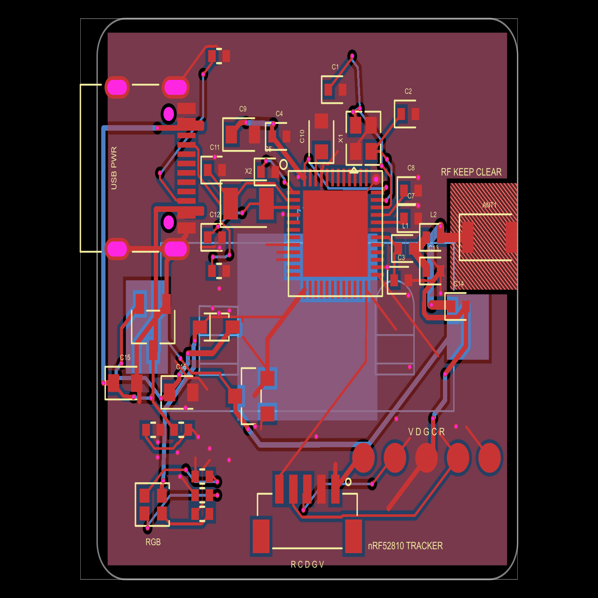
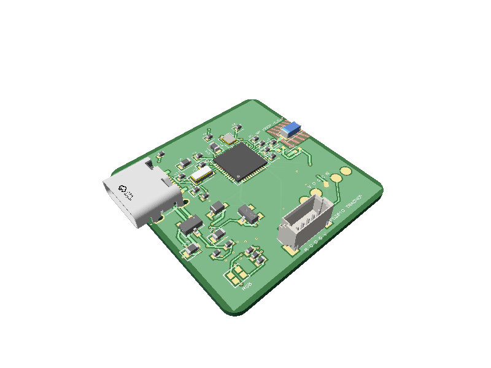

# nRF52810 CR2032 Bluetooth tracker

A compact, two-layer [tscircuit](https://tscircuit.com) board built around Nordic Semiconductor's `NRF52810-QFAA-R`. It is a hardware starting point for a low-duty-cycle Bluetooth Low Energy advertising tracker powered by either a replaceable CR2032 primary cell or a power-only USB-C input.





## Hardware

- 30 mm × 30 mm, 1.0 mm thick, two-layer PCB with rounded corners
- `NRF52810-QFAA-R` in QFN48 using its internal LDO supply configuration
- Bottom-mounted `MY-2032-16` holder with a P-channel MOSFET battery-isolation path
- Power-only USB-C input with 5.1 kΩ CC pull-downs, a 3.3 V MCP1700 LDO, and Schottky source isolation
- Common-anode RGB status LED on three PWM-capable GPIOs
- 32 MHz HFXO and 32.768 kHz LFXO crystals
- Edge-mounted Walsin `RFANT3216120A5T` 2.4 GHz chip antenna
- Nordic 3.9 nH / 0.8 pF radio network, a 6.8 nH antenna-series baseline, and DNP tuning pads
- Five-pin JST-SH SWD connector plus five 2.5 mm-pitch programming pads
- Top and bottom GND pours with a copper-free antenna window

The source is in [`index.circuit.tsx`](index.circuit.tsx), and [`BOM.csv`](BOM.csv) lists the parts used by the design.

## Build the PCB

Install [Bun](https://bun.sh), then run:

```sh
bun install
bun run typecheck
bun run build -- --all-images
```

The generated circuit data and renders are written to `dist/`.

## Battery

Use a non-rechargeable CR2032 cell only. The board does not contain a battery charger. USB power is isolated from the cell and must never be treated as a charging input.

The holder is on the bottom. Its two outer clip pads connect to `VBAT_RAW`; the large center contact is `GND`. With the normal holder orientation, insert the cell with its marked `+` face toward the retaining clip.

With USB disconnected, `Q1` turns on and connects the coin cell to the system `VBAT` rail with low loss. When USB is present, the 5 V VBUS signal turns `Q1` off so the cell is disconnected while the USB regulator supplies the board.

## USB-C power

`J1` is a power-only USB-C sink. Its USB 2.0 data and SBU pins are intentionally unconnected, so it cannot program the nRF52810 and does not provide serial communication. The two 5.1 kΩ CC resistors request the source's default USB 5 V supply; do not apply a higher fixed voltage or bypass USB-C negotiation.

`U2` regulates VBUS to 3.3 V and `D_USB` isolates its output from `VBAT`, leaving approximately 3.0–3.1 V at the system rail under normal USB-powered loads. The USB connector is on the left edge, opposite the antenna. Keep an attached cable away from the antenna end during RF measurements.

## SWD programming connections

The board has no USB programmer or preloaded bootloader, so the first firmware image must be written over SWD. Use a SEGGER J-Link or the debug-out connection of a Nordic nRF52/nRF52840 DK.

The bottom-edge `J2` connector is a 1.0 mm-pitch JST-SH-compatible five-pin SWD connection:

| J2 pin | Signal | Probe connection |
| --- | --- | --- |
| 1 | `VTREF` / `VBAT` | Target voltage reference |
| 2 | `GND` | Ground |
| 3 | `SWDIO` | SWD data |
| 4 | `SWDCLK` | SWD clock |
| 5 | `nRESET` | Target reset |

The board-edge silkscreen reads `R C D G V` from left to right when viewing the PCB from the top, corresponding to J2 pins 5 through 1. Verify the cable orientation and pin numbering; JST-SH debug cables do not have one universal pinout.

The five round backup pads run along the lower-right edge. They read left to right as `V D G C R`:

| Mark | Signal | Probe connection |
| --- | --- | --- |
| V | `VDD` / `VBAT` | Target voltage reference (`VTref`) |
| D | `SWDIO` | SWD data |
| G | `GND` | Ground |
| C | `SWDCLK` | SWD clock |
| R | `nRESET` | Target reset |

Power the target before connecting to it, using either the CR2032 or USB-C. A probe's `VTref` pin normally senses the target voltage and does not necessarily power the board. If a probe supplies 3.0 V to `VTREF` instead, disconnect USB and remove the coin cell so the probe cannot back-power either source. Use 3.0 V-compatible I/O and never apply 5 V to `VTREF`.

`SWDIO`, `SWDCLK`, `GND`, and `VTref` are required. `nRESET` is recommended and is useful during recovery.

## RGB status LED

`LED1` is a common-anode RGB LED powered from `VBAT`. Each color is active-low through a 1 kΩ resistor:

| Color | nRF52810 GPIO |
| --- | --- |
| Blue | `P0.06` |
| Green | `P0.07` |
| Red | `P0.08` |

Drive a channel low to illuminate it and high (or high-impedance) to turn it off. These pins support PWM for color mixing, but this is not an addressable WS2812/WLED device. A CR2032 is poorly suited to sustained LED current, so use short, low-duty-cycle indications; green and blue brightness will also fall as battery voltage drops.

## Build Bluetooth firmware with Zephyr

Install a current Zephyr or nRF Connect SDK workspace and its toolchain. Zephyr supports the nRF52810 through the `nrf52dk/nrf52810` target. From the root of a workspace, a minimal non-connectable beacon can be built with:

```sh
west build -b nrf52dk/nrf52810 zephyr/samples/bluetooth/beacon
```

The resulting image is normally `build/zephyr/zephyr.hex`.

The target definition models the nRF52810 memory and peripherals, but it also describes the nRF52 DK carrier. This custom PCB does not contain the DK's LEDs, buttons, or USB-UART bridge. Do not enable application features that depend on those devices; add a custom Zephyr board definition when the tracker firmware needs precise pin assignments or hardware descriptions.

With the SWD probe connected, the standard Zephyr runner can usually program the image directly:

```sh
west flash
```

If more than one compatible probe is connected, select the intended probe using the runner options shown by `west flash --context` or program the HEX file directly as described below.

## Program a HEX file with nRF Util

Install Nordic's current `nrfutil` executable, install its `device` command, and list the attached probes:

```sh
nrfutil install device
nrfutil device list
```

Program, verify, and reset the nRF52810, replacing the serial number and firmware path:

```sh
nrfutil device program \
  --serial-number <probe-serial-number> \
  --firmware build/zephyr/zephyr.hex \
  --options chip_erase_mode=ERASE_RANGES_TOUCHED_BY_FIRMWARE,verify=VERIFY_READ,reset=RESET_SYSTEM
```

If access-port protection prevents programming, recovery is available but erases the entire flash and UICR:

```sh
nrfutil device recover --serial-number <probe-serial-number>
```

Then repeat the programming command. Do not use recovery on a device whose provisioning data has not been backed up.

## Radio layout and tuning

The final L2-to-antenna feed is an explicitly straight top-layer trace with no vias. The antenna sits at the right edge inside a top/bottom copper-free window enforced by a routing keepout. The keepout's `excludeRefs={[".ANT1"]}` allows the manually routed antenna feed to enter without suppressing violations from unrelated traces; it remains a hard obstacle to the autorouter. Keep metal, the battery, enclosure ribs, cables, and a user's hand as far from that edge as the product permits.

`L1 = 3.9 nH` and `C3 = 0.8 pF` follow Nordic's nRF52810 LDO reference network. `L2 = 6.8 nH` is a starting value from the Walsin antenna reference board. `C13` and `C14` are unpopulated tuning positions. Tune the complete assembled product with a VNA after selecting the enclosure, battery, PCB material, and manufacturer stack-up.

The antenna feed geometry is not automatically a guaranteed 50 Ω impedance. Recalculate it using the fabricator's actual dielectric thickness and copper weight before production.

## Fabrication notes

- Two layers, 1.0 mm FR-4, 1 oz copper
- Minimum 0.15 mm signal trace/clearance; verify against the generated Gerbers and selected fab rules
- Tent the local ground vias where supported
- Use C0G/NP0 parts for 12 pF, 100 pF, 0.8 pF, and any fitted RF tuning capacitors
- Use high-Q 0402 inductors for L1 and L2
- Leave C13 and C14 unpopulated until RF measurements call for them

Ground-transition vias are placed adjacent to the exposed pad and local C3, C7, and C8 ground terminals. The layout intentionally avoids via-in-pad, including at the USB-C connector.

## Production warning

This is a prototype starting point, not production sign-off. A tracking product still needs suitable firmware, identity provisioning, privacy and anti-stalking controls, and a measured power budget. Before sale, independently review the schematic and PCB, confirm footprints and polarity, tune and certify the radio in its final enclosure, and complete applicable battery, EMC, Bluetooth qualification, and regional regulatory work.

## References

- [Nordic nRF52810 product specification](https://docs.nordicsemi.com/r/bundle/ps_nrf52810/page/keyfeatures_html5.html)
- [Zephyr nRF52 DK and `nrf52dk/nrf52810` target](https://docs.zephyrproject.org/latest/boards/nordic/nrf52dk/doc/index.html)
- [Nordic nRF Util device programming](https://docs.nordicsemi.com/r/bundle/nrfutil/page/nrfutil-device/guides/programming_segger_ob.html)
- [Nordic nRF Util recovery](https://docs.nordicsemi.com/r/bundle/nrfutil/page/nrfutil-device/guides/programming_recovery.html/recovering-nrf52-nrf54l-and-nrf91-series-devices)
- [Walsin RFANT3216120A5T approval sheet](https://datasheet.lcsc.com/lcsc/1810201611_Walsin-Tech-Corp-RFANT3216120A5T_C127629.pdf)
